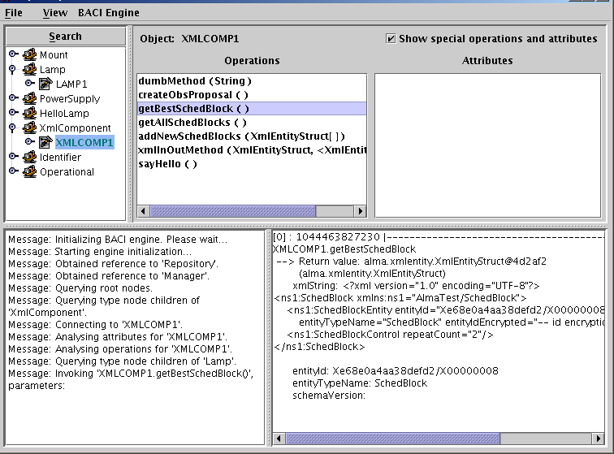

=======
Clients
=======

A component can have different kinds of clients which we’ll discuss separately:

------------------------------
Generic Client: ObjectExplorer
------------------------------

We can use the ACS tool ObjectExplorer as a generic client for all components.  Run it with::

    objexp

and you should find your Java components (e.g. XmlComponent) and their instances (e.g. XMLCOMP1) listed on the dialog, together with C++ components (e.g. Lamp).

At first, you see only a visualization of the information in the CDB, as opposed to actually loaded components. When you click on a component instance, the Manager will tell the Container to activate the component with the given instance name. 

The screenshot shows the output after XMLCOMP1 has been loaded and the method getBestSchedBlock has been called (with View → Expand result data checked in ObjectExplorer.)

    Screenshot of the Object Explorer, as seen in this example.

----------------
Client Component
----------------

We’ve seen the example of a Java component accessing a C++ Component in 4.2, and a Java component accessing another Java component without transparent XML binding support referenced in 5.1.

To use support for xml binding classes on the client side of a call, we first obtain the other component (here: XMLCOMP1)::

    XmlComponent xmlComp = alma.demo.XmlComponentHelper.narrow(getComponent("XMLCOMP1"));

and then ask the container to wrap it with the more convenient interface that uses XML binding classes, provided in the ContainerServices interface::
    
    XmlComponentJ xmlCompJ = (XmlComponentJ) m_containerServices.createXmlBindingWrapper(
                                XmlComponentJ.class,
                                xmlComp,
                                XmlComponentOperations.class);

Now we can keep working with xmlCompJ, and the framework will delegate all calls to xmlComp, translating between XML binding classes and serialized XML presentation in between.

-----------------
JUnit Test Client
-----------------

To facilitate the writing of JUnit test clients, ACS (module jcont) offers the class ``alma.acs.component.client.ComponentClientTestCase`` which is a subclass of JUnit’s TestCase that does the talking with ACS Manager. It provides most of the functionality that ContainerServices provides for components.  

A JUnit test that gets a reference to the XmlComponent component and runs some tests on it is 
jcontexmpl/src/alma.demo.client.XmlComponentClient

::

    020 package alma.demo.client;
    022 import alma.acs.component.client.ComponentClientTestCase;
    023 import alma.demo.SchedBlockHolder;
    024 import alma.demo.XmlComponent;
    025 import alma.demo.XmlComponentException;
    026 import alma.demo.XmlComponentJ;
    027 import alma.demo.XmlComponentOperations;
    028 import alma.entities.commonentity.EntityT;
    029 import alma.xmljbind.test.obsproposal.ObsProposal;
    030 import alma.xmljbind.test.schedblock.SchedBlock;
    031 
    039 public class XmlComponentClient extends ComponentClientTestCase
    040 {
    042   private XmlComponentJ m_xmlCompJ;
    043 
    049   public XmlComponentClient() throws Exception {
    050     super("XmlComponentClient");
    051   }
    052 
    053   protected void setUp() throws Exception {
    054     super.setUp();
    055 
    056     org.omg.CORBA.Object compObj = getContainerServices().getComponent(
    057         "XMLCOMP1");
    058     assertNotNull(compObj);
    059     XmlComponent xmlComp = alma.demo.XmlComponentHelper.narrow(compObj);
    060 
    061     m_xmlCompJ = (XmlComponentJ) getContainerServices()
    062         .getTransparentXmlComponent(XmlComponentJ.class, xmlComp,
    063             XmlComponentOperations.class);
    064 
    065     assertNotNull(m_xmlCompJ);
    066   }
    067 
    071   public void testSayHelloUsingHelloDemoComponent() {
    072     String reply = m_xmlCompJ.sayHello();
    073     assertNotNull(reply);
    074     System.out.println("received reply " + reply);
    075     assertEquals("reply must be 'hello'", "hello", reply);
    076   }
    077 
    081   public void testCreateObsProposal() {
    082     ObsProposal obsProp = m_xmlCompJ.createObsProposal();
    083     assertNotNull(obsProp);
    084 
    085     EntityT ent = obsProp.getObsProposalEntity();
    086     assertNotNull(ent);
    087 
    088     String id = ent.getEntityId();
    089     assertNotNull(id);
    090 
    091     System.out.println("received ObsProposal with id " + id);
    092   }
    093 
    094   public void testXmlInOutMethod() {
    095     ObsProposal obsProp = m_xmlCompJ.createObsProposal();
    096     assertNotNull(obsProp);
    097     SchedBlockHolder sbh = new SchedBlockHolder();
    098 
    099     m_xmlCompJ.xmlInOutMethod(obsProp, sbh);
    100 
    101     SchedBlock schedBlock = sbh.value;
    102     assertNotNull(schedBlock);
    103 
    104     EntityT ent = schedBlock.getSchedBlockEntity();
    105     assertNotNull(ent);
    106     String id = ent.getEntityId();
    107     assertNotNull(id);
    108 
    109     System.out.println("received out-param SchedBlock with id " + id);
    110   }
    111 
    117   public void testException() throws Exception {
    118     boolean gotException = false;
    119 
    120     try {
    121       m_xmlCompJ.exceptionMethod();
    122     }
    123     catch (XmlComponentException e) {
    124       gotException = true;
    125       System.out.println("received XmlComponentException as intended.");
    126     }
    127 
    128     assertTrue("must receive XmlComponentException", gotException);
    129   }
    130 }

The constructor must call the constructor of the base class (c.f. line 50) with a name to be used for this client (here: “XmlComponentClient”). If you override the setup() method, it’s necessary there to call super.setUp() first (see line 54). 

JUnit will call all methods that start with “test” in their name, such as testException().

In the Eclipse Java Perspective, you can run such a class with JUnit. Open the class in the editor, then choose
Menu Run → Run As → JUnit Test. It will display the results.