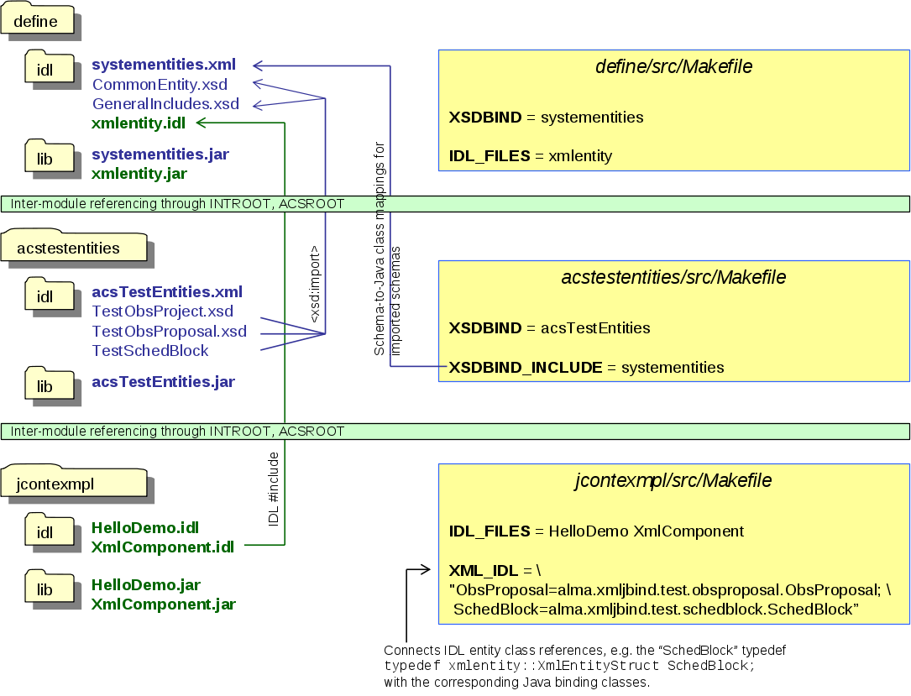
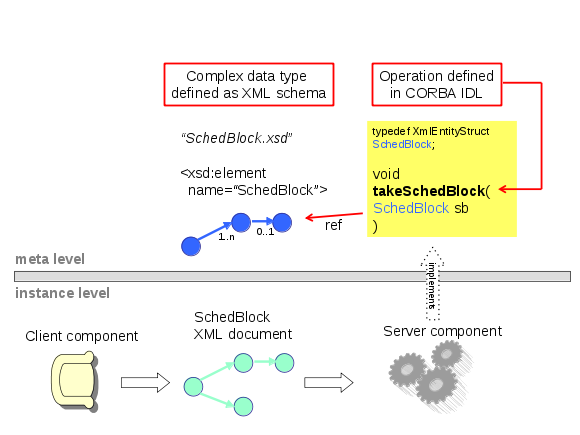

===================================
Creating the XmlComponent Component
===================================

Unlike the previous HelloDemo, the component XmlComponent uses entity objects that are transported over the network as serialized XML. We will focus on this feature and not repeat things which have already been demonstrated before. 

------------------
XML entity classes
------------------

Overview
--------

The term “entity” refers to non-primitive, non-binary data with identity such as scheduling blocks, system users, correlator configurations etc., c.f. [Ref1]_. These data types are defined in XML schemas. Their instances are XML “documents” that get passed around by value and can be stored in the ALMA Archive. 

From the XML schemas, we produce Java classes at build-time, based on the Castor framework [Ref12_]. These binding classes represent the hierarchical data structure in memory. They have type-safe methods to navigate the tree and to access data items. The binding classes can be automatically instantiated from XML documents that correspond to the same schema, and can serialize their data into stringified XML. 

The idea of “transparent XML entities” is to have the entity objects transported by CORBA as language-neutral XML strings. However, the Java component implementations (both client and server involved in the remote call) don’t have to worry about the serialization and parsing of the XML. The main advantage of this is that the framework ensures type safety, from the IDL/schema definitions, all the way down to the Java implementation classes of a component; it’s not possible to be surprised at runtime that the received XML differs in type or version from what the component expected. To achieve this, the implementation classes use modified component interfaces, in which Java binding classes are substituted for the structs with serialized XML. An example with detailed explanation will be given in 5.3.

A Java component that acts either as a client or as a server with respect to some other component, is completely independent in its decision whether to parse XML entity objects “by hand” or to enjoy transparent support for binding classes. The other component may be written in Java, C++, or whatever other language, and it may or may not use binding classes[6]_. 
For example, a Java client that exchanges XML entity objects with a C++ server can work with Java binding classes, whereas the C++ server parses the XML using a SAX parser. 

.. [6] If this other component is written in Java, the developer has a real choice on this; for C++ at least at the moment there is no support for XML binding classes, so the C++ XML parser (expat) that comes with ACS should be used.

Designing entity schemas
------------------------

We define complex data types in XML schema and use these types in CORBA IDL similar to how CORBA structs would be used.

To keep this tutorial focused on component development, we only touch on the schema development issue. Rather than showing how to develop a new schema, we use the existing schemas from the module acstestentities. 

For XML schemas describing ALMA entities, there are the following conventions:

* One schema per entity. This means that the entity “SchedBlock“ must be defined in a different XML schema than the entity “ObsProject”. “Different schema” really means “different schema namespace”; on the file level, one schema can be composed of various files connected through <xsd:include>, as long as these files belong to the same namespace. The reason for using included files would be to make large schemas more readable for the human eye.

* XML namespaces: the typical convention would be to use a namespace that looks like an internet URL (e.g. targetNamespace="http://www.alma.org/xmlschemas/obsprep"). This does not work for ALMA though, since “alma.org” is not ours, and “alma.int” conflicts with the integer type in Java. 
 Thus in ALMA, the namespace should be “Alma/<subsystem>/<schemaName>” (e.g. “Alma/ObsPrep/SchedBlock”). Our test schemas use the namespace “AlmaTest/schemaName” instead.
 
* XML schemas consist of “elements” and “types”. Names of schema types must end with a “T”, like in ``<xsd:complexType name="ObsUnitT">``. This avoids problems with generating binding classes (e.g. alma.mypackage.ObsUnitT), and makes it easier to find a name for a wrapper class that adds functionality to such a binding class (e.g. alma.mywrappers.ObsUnit).

* Top-level entities are defined as the root elements in a schema file, like ObsProject or SchedBlock. To allow the system to store administrational data like ID, version etc., the root element must have a child element of type EntityT (defined in the ACS module “define”/idl/CommonEntity.xsd, with the xml namespace “Alma/CommonEntity”). 
 For example, in the schema file ObsProject.xsd, the schema element ObsProject has a child of type ObsProjectEntityT, which inherits from EntityT.
 Perhaps it would have been more intuitive to use an inheritance convention instead of composition (SchedBlock could inherit from EntityT), but since XML schema only allows single inheritance, we don’t want to use it up for the sake of the framework. In the file SchedBlock.xsd we see that in fact our schema element “SchedBlock” inherits from ObsUnitT, which would not have been possible otherwise. 
 
* From one entity object (that is, an XML document) you can reference another entity object through the ID. In the schema, this must be declared uniformly using (a subtype of) EntityRefT, which declared in the schema file CommonEntity.xsd. 
For example, a SchedBlock references the ObsProject to which it belongs. The schema element SchedBlock has a child element ObsProjectRef whose type inherits from EntityRefT. Therefore, an XML document for a SchedBlock entity can reference another XML document that is an ObsProject.

Compiling entity schemas
------------------------

Schema files must be put into the /idl directory of your module, or into the ICD/<yourSubsystem>/ws/idl directory if Like IDL files are meant to be used by other subsystems. Please check with ALMA software engineering.

You must add information to your module’s Makefile so that the XML schemas can be compiled into Java binding classes. Let’s look at how acstestentities/src/Makefile has it:

XSDBIND = acsTestEntities

tells the build process to look for a configuration file ../idl/acsTestEntities.xml which must provide information about the schema files to be compiled (see below). The resulting Java classes will then be packed into ../lib/acsTestEntities.jar. 

Schema files can include or import other schema files. In our case, CommonEntity.xsd from the module ACS/define, systementities.jar, is imported. In our Makefile, the line

XSDBIND_INCLUDE = systementities

is required so that the build process can set the include path for the schema compiler.
Here’s a reduced listing of the configuration file /idl/acsTestEntities.xml

.. highlightlang:: xml

::

    <?xml version="1.0" encoding="UTF-8" ?> 
    <EntitybuilderSettings>
    <EntitySchema schemaName="TestObsProject.xsd" xmlNamespace="AlmaTest/ObsProject" /> 
    <EntitySchema schemaName="TestObsProposal.xsd" xmlNamespace="AlmaTest/ObsProposal" /> 
    <EntitySchema schemaName="TestSchedBlock.xsd" xmlNamespace="AlmaTest/SchedBlock" /> 
    <XmlNamespace2JPackage xmlNamespace="AlmaTest/ObsProject" jPackage="alma.xmljbind.test.obsproject" /> 
    <XmlNamespace2JPackage xmlNamespace="AlmaTest/ObsProposal" jPackage="alma.xmljbind.test.obsproposal" /> 
    <XmlNamespace2JPackage xmlNamespace="AlmaTest/SchedBlock" jPackage="alma.xmljbind.test.schedblock" /> 
    </EntitybuilderSettings>

We see that schema files are listed together with their xml namespaces (<EntitySchema>). Then the namespaces are mapped to Java packages (<XmlNamespace2JPackage>). Files and packages are separated here because several schema files can use the same xml namespace, but the Java package of the resulting classes must depend on the namespace, not the schema file.

Note that the compilation of xml schemas is specified differently in the Makefile, compared with the compilation of IDL files. IDL files are listed individually and are compiled into one jar file each, whereas schema files are only referenced indirectly through their XML configuration file, and are compiled into only one jar file per module.

   The diagram above illustrates the relationships among the xml schema files, IDL files, and Makefiles from our module “acsjexmpl” and the modules “define” and “acstestentities” from where resources are used by the example module.

---
IDL
---

Using XML schema types in IDL - general idea
--------------------------------------------

The diagram below shows how to use the XML schema definition of a SchedBlock in the IDL definition of a component interface.

XmlComponent.idl
----------------

Here’s a thinned-out listing. Since lines are missing, we use letter tags instead of line numbers.

.. highlightlang:: idl

::

    A   #include <xmlentity.idl> 
        #include <acscomponent.idl>
    B   #pragma prefix "alma"

    C   module demo
        {
    D       typedef xmlentity::XmlEntityStruct ObsProposal;
            typedef xmlentity::XmlEntityStruct SchedBlock;
            typedef sequence <SchedBlock> SchedBlockSeq;

    E       exception XmlComponentException {}; 

    F       struct ObsProjectTree
            {
                    ObsProposal prop;
                    SchedBlockSeq schedBlocks;
            };

    G       interface XmlComponent : ACS::ACSComponent
            {
    H               long dumbMethod(in string somevalue);                 
    I               ObsProposal createObsProposal();
    J               SchedBlockSeq getAllSchedBlocks();
    K               void xmlInOutMethod(in ObsProposal opsPropIn, 
                                            out SchedBlock schedBlockOut);                                
    L               ObsProjectTree getEntireTreeInAStruct();                
    M               void exceptionMethod() raises (XmlComponentException);
            };
        };

===  =====================
A    
     xmlentity.idl comes from define/idl and declares the CORBA struct XmlEntityStruct which is used to transport serialized XML together with some meta data. It must be included whenever xml entity objects are used (see I-K). The developer does usually not have to know the details of that struct.
B
     The prefix pragma must come after the include statements; this restriction might be lifted in the future, but for now the TAO IFR would have a problem otherwise.
C
     We use the same module as for the HelloDemo component
D
     Typedefs for xml entity classes. The interface methods that use entity classes as parameters or return types (see H-K) must use these named typedefs like ‘ObsProposal’ instead of ‘XmlEntityStruct’. This not only makes the interface more readable, but is also required for the automatic use of Java binding classes.
     Notice that the defined names are used to match the XML entity (IDL struct) with its corresponding binding class. For instance, “ObsProposal” will be matched to the Java class alma.xmljbind.test.obsproposal.ObsProposal. 
E
     Declaration of an exception. (How to use the ACS Error System [6] instead of plain CORBA exceptions may be demonstrated in a future version of this document.)
F
     A struct that contains XML entities.
G
     Interface declaration for the XmlComponent
H
     Just to have something dumb in here
I
     Method that returns an xml entity object (as a struct that contains the xml data as a string if the component is accessed as a plain CORBA object, see below.)
J
     Demonstrates the use of a sequence (~array) of xml entity objects
K
     Demonstrates the use of xml entity objects as an OUT parameter
L
     Uses the ObsProjectTree struct, with entities inside
M
     Uses an exception (again, later the mechanism described in [6] will be used.)
===  =====================

Compiling IDL
-------------

We have to add the new IDL file to jcontexmpl/src/Makefile: ::

    IDL_FILES = HelloDemo XmlComponent

In addition to running this file through the standard CORBA IDL compiler, it is also fed into the “ACS IDL compiler”. This tool gets started by the build process, so you never have to see it; the interested reader can find it in the CVS module ACS/…/XmlIdl. The ACS IDL compiler creates additional Java classes which the CORBA IDL compiler would not create. They are used for working with Java XML binding classes instead of plain XML strings, see 5.1.1.

In the Makefile, the line ::

    XML_IDL = "ObsProposal=alma.xmljbind.test.obsproposal.ObsProposal; \
            SchedBlock=alma.xmljbind.test.schedblock.SchedBlock"

provides the mapping from IDL typedefs (see lines 6-8) to Java binding classes (conceptually: to the schema that defines the entities).

The Java files that are produced from XmlComponent.idl are 

=======================  =====================
Functional interfaces    XmlComponentOperations.class, XmlComponentJ.class
Client-side CORBA        _XmlComponentStub.class, XmlComponent.class
Server-side CORBA        XmlComponentPOA.class, XmlComponentPOATie.class
Helper & holder classes  
                         ObsProposalHelper.class, ObsProposalHolder.class, SchedBlockHelper.class, SchedBlockHolder.class, SchedBlockSeqHelper.class, SchedBlockSeqHolder.class, SchedBlockSeqJHolder.class, XmlComponentHelper.class, XmlComponentHolder.class
=======================  =====================

The classes shown in normal print are mandated by CORBA standards and generated by the CORBA IDL compiler, while the italicized classes are required by the ACS framework and are generated by the ACS IDL compiler.

------------------------
Component Implementation
------------------------

In section 5.2, we saw the IDL file with the typedefs for the entity classes, and their use in the methods of the XmlComponent interface. 

The following two functional interfaces have been generated for XmlComponent. The component implementation must implement one of them:

* XmlComponentOperations uses serialized XML; if the component implemented this interface, it would have to parse and serialize the xml entity objects “manually”. 
* XmlComponentJ uses Java binding classes; the container will offer transparent parsing and serialization of XML.

We will choose the convenience and type-safety offered when implementing XmlComponentJ. The interface generated by the ACS IDL compiler is listed below (Javadoc lines omitted).

.. highlightlang:: java

::

    01 package alma.demo;
    02 
    03 /**
    04  * XML binding class aware ACS component interface XmlComponentJ */
    05 public interface XmlComponentJ extends alma.ACS.ACSComponentOperations
    06 {
    10     public int dumbMethod(String somevalue);
    11
    15     public alma.xmljbind.test.obsproposal.ObsProposal createObsProposal();
    16 
    25     public alma.xmljbind.test.schedblock.SchedBlock[] getAllSchedBlocks();
    26 
    30     public void addNewSchedBlocks(
                        alma.xmljbind.test.schedblock.SchedBlock[] newSchedBlocks);
    31 
    35     public void xmlInOutMethod(
                        alma.xmljbind.test.obsproposal.ObsProposal opsPropIn, 
                        alma.demo.SchedBlockHolder schedBlockOut);
    36 
    40     public alma.demo.ObsProjectTreeJ getEntireTreeInAStruct();
    41 
    50     public void exceptionMethod()
    51         throws alma.demo.XmlComponentException;
    53 }
    
Comparing this with the IDL definition, we see that binding classes like alma.xmljbind.test.schedblock.SchedBlock are used whenever the IDL contained a typedef’d entity struct. In addition to this direct substitution, the ACS IDL compiler created the class ObsProjectTreeJ which contains binding classes, thus substituting the IDL struct ObsProjectTree as the return type of the method getEntireTreeInAStruct();

Let’s look at the implementation of the method createObsProposal().

::

    121   public ObsProposal createObsProposal()
    122   {
    123     ObsProposal obsProp = new ObsProposal();
    124     
    125     try
    126     {
    127       ObsProposalEntityT entity = new ObsProposalEntityT();
    128       m_containerServices.assignUniqueEntityId(entity);
    129       obsProp.setObsProposalEntity(entity);
    130       
    131       obsProp.setPerformanceGoals(
                    "peak performance enduring a 24-7-365 schedule.");
    132     }
    133     catch (ContainerException e)
    134     {
    135       m_logger.log(Level.SEVERE, "failed to create ObsProposal. ", e);
    136     }
    137     
    138     return obsProp;
    139   }
    
We see that the Java class ObsProposal has type-safe methods like “setPerformanceGoals” or “setObsProposalEntity”. 
The latter takes an object of type ObsProposalEntityT, also generated by the binding framework. It is used to store administrational information about the ObsProposal object, most important the object ID. 

For a new entity object, a valid and unique object ID can be obtained conveniently through a call to ContainerServices#assignUniqueEntityId, for which the container collaborates with the archive. If the archive is not present, it defaults to using random numbers which should be almost always unique (2^64).

Our method implementation simply returns the top-level Java object for the ObsProposal. The container framework will then automatically serialize it to XML, embed the string in the XmlEntity CORBA struct, and send it to the client using CORBA. If the client is another Java component, its container will automatically create an ObsProposal class and fill it with the data from the serialized XML. 

To keep the size of this tutorial small, the implementations of the other methods are not listed here. They are meant to serve as more detailed examples, for which the source code of the module jcontexmpl should be retrieved anyway. 
Alternatively, the code listing can be found online at the ACS documentation site:
http://www.eso.org/projects/alma/develop/acs/OnlineDocs/jcontexmpl/doc/html/XmlComponentImpl_8java-source.html 

To see how the code would look like if the component would implement XmlComponentOperations, take a look at the inner class XmlComponentHelper::IFTranslator.