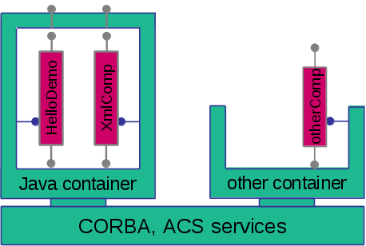

Designing the Components
------------------------

During the design of your ALMA subsystem, you should partition your software into one or preferably several components [2]_. A component will be the smallest chunk of software that can be deployed separately, e.g. in its own process or even on its own machine. Guidelines are that a component should be small enough to be functionally cohesive (having exactly one functional interface with related methods), but large enough to keep the number of components sufficiently small. Typically, a component will be made up of several Java classes, and a subsystem might consist of a handful of components.
There can be components that will be used by other subsystems, while other components are only used internally by the subsystem. In either case, the functional interface must be specified as CORBA IDL. 

The example components that we’ll look at in the tutorial are not jewels of OO design, but they are meant to illustrate the steps involved to get to an implementation. The detailed motivation for all methods used in the interfaces is described in the next section about IDL.

We will work with 
* a simple Java component “HelloDemo” that implements the notorious sayHello() method, both plain and with primitive dummy parameters
* a fancier “XmlComponent” that demonstrates the handling of XML entity objects with the transparent use of Java binding classes.

The components and their containers can be pictured as follows, with the “antennas” sticking out on top being the functional interfaces.

.. [2] The “subsystem master component” concept may be included in this tutorial in the future

   Components types: tight container, porous container
   
The two Java components, HelloDemo and XmlComponent, can either run collocated inside one Java container as shown, or run in separate Java containers. The Java container is drawn as a closed box to indicate that it works as a “tight container” (cf. [Ref1]_), intercepting all functional calls to any of its components, in addition to starting/stopping the components and providing explicit services to them.

The Java components can talk with, say, a C++ component “otherComp”, which must run inside a C++ container (“other Container”). That container is drawn open to indicate that it is a “porous” kind of container which only takes care of starting/stopping the components, but does not intercept functional calls on the running components.

The ACS containers use CORBA and the ACS services, the ACS Manager, and the Configuration Database. The Manager itself also uses the CDB.